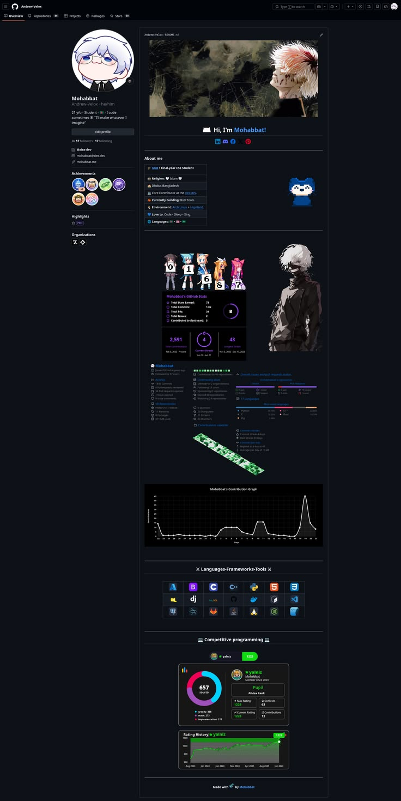
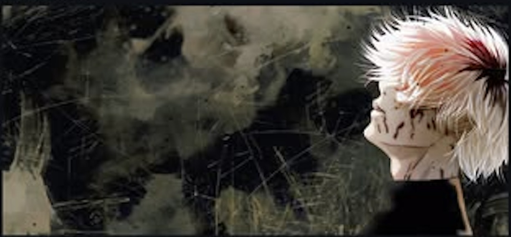
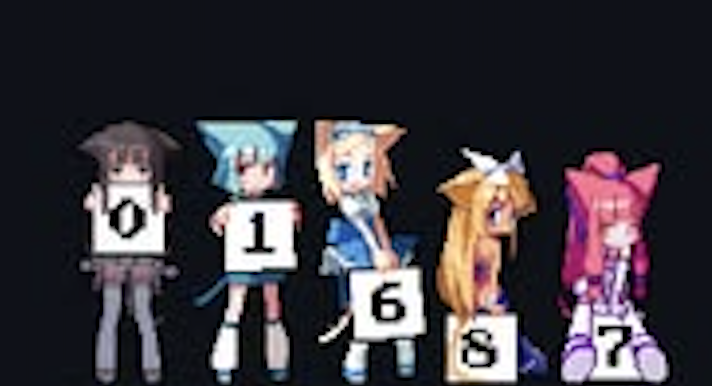

# 👋 Hi, I'm Sanjjay!

## About me

- 🎓 Second-year B.Tech CSE (Business Systems) student at **Sri Manakula Vinayagar Engineering College (SMVEC)**, Pondicherry
- 🚀 Founder of **DarkSyntax** — a solo web development & AI integration agency
- 🏥 Currently serving 2 live clients in the diagnostics sector: **Om Sakthi Diagnostic Centre** & **Infinity Diagnostics**
- 🧠 Building my own AI-powered products alongside client work
- 📍 Based in Pondicherry, India
- 💬 Ask me about web dev, AI integration, or offline AI tooling

## 🛠️ Languages, Frameworks & Tools

  

## 📊 GitHub Stats

  
  

  

## 🚧 Currently Building

- **ThinkStick** — offline USB-based AI assistant running GGUF models via llama.cpp
- **WebCraft AI** — AI product concept & AWS deployment portfolio project
- **Staravia** — rebrand & recovery of the skill-exchange-connect project

  

<i>Made with ❤️ by Sanjjay</i>

