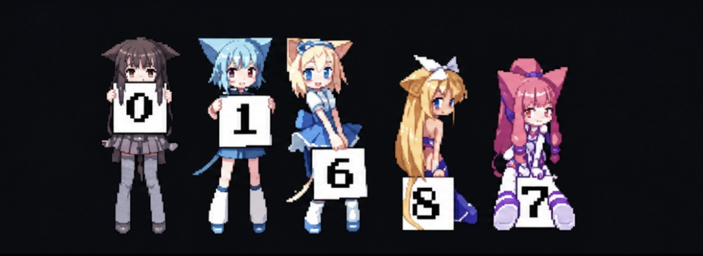

<!--
  GitHub Profile README for github.com/sanjjaystars
  Keep this README and the assets/ folder together in the public sanjjaystars repository.
-->

<div align="center">
  

  <h1>⌁ Hi, I’m <a href="https://github.com/sanjjaystars">Sanjjay</a>!</h1>
  <p><i>Code · Learn · Solve</i></p>

  <a href="https://github.com/sanjjaystars">
    
  </a>
  <a href="https://leetcode.com/u/SANJJAY73/">
    
  </a>
</div>

<hr />


### About me

```python
   def __init__(self):
        self.name = "Sanjjay Aroumougam"
        self.role = "Web & App Developer | Cybersecurity Enthusiast"
        self.location = "Pondicherry, India"
        self.education = "CSBS Undergrad"
        self.os = [" Arch ", " Kali "," Fedora ","MACOS"]

    def get_tech_stack(self):
        return {
            "languages": ["Python", "HTML", "JavaScript", "Dart"],
            "frontend": ["React", "Tailwind CSS", "Flutter"],
            "backend": ["FastAPI", "Firebase", "PostgreSQL"],
            "tools": ["Git", "Docker", "Burp Suite", "Scapy"]
        }

    def say_hi(self):
        print(f"Thanks for visiting {self.name}'s profile!")

me = Sanjjay()
me.say_hi() )
```

<hr />

<div align="center">
  
  <br />
  <sub>✦ Keep moving forward, one contribution at a time. ✦</sub>
</div>

<br />

### GitHub stats

<div align="center">
  
  
</div>

<br />

### Contribution graph

<div align="center">
  
</div>

<br />

### LeetCode

<div align="center">
  <a href="https://leetcode.com/u/SANJJAY73/">
    
  </a>
</div>

<br />

### Languages · frameworks · tools

<div align="center">
  <!-- Update this row to match the technologies you use. -->
  
</div>

<br />

<div align="center">
  
</div>

<hr />

<div align="center">
  <sub>Made with ☕ and consistency by <a href="https://github.com/sanjjaystars">Sanjjay</a></sub>
</div>
